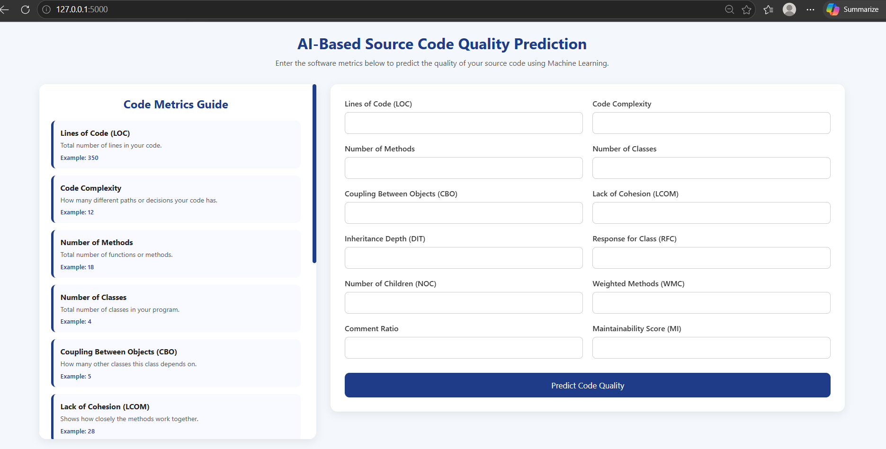
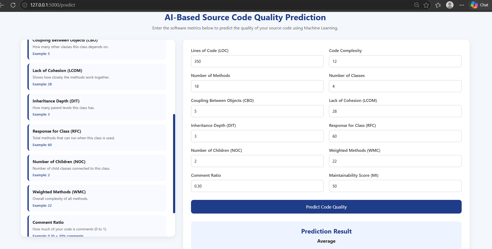
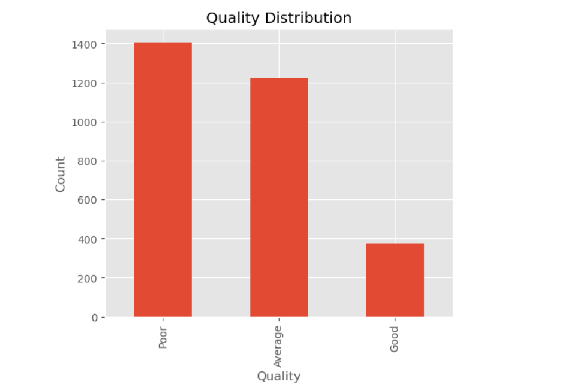
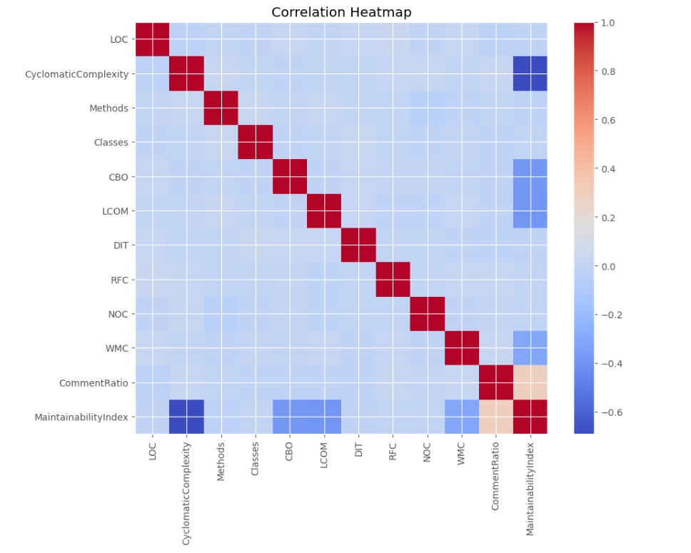
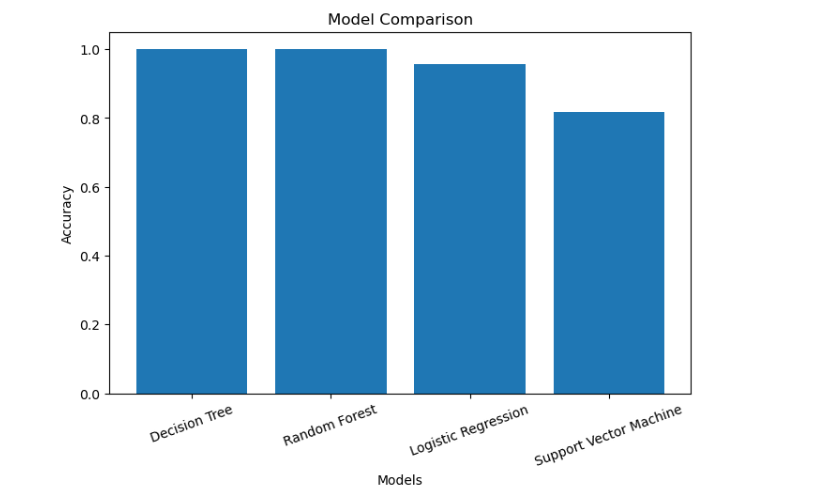
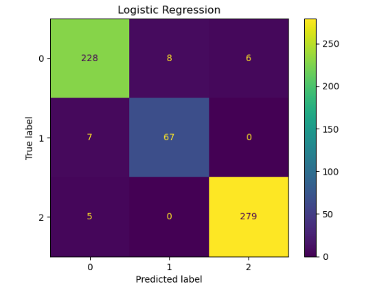
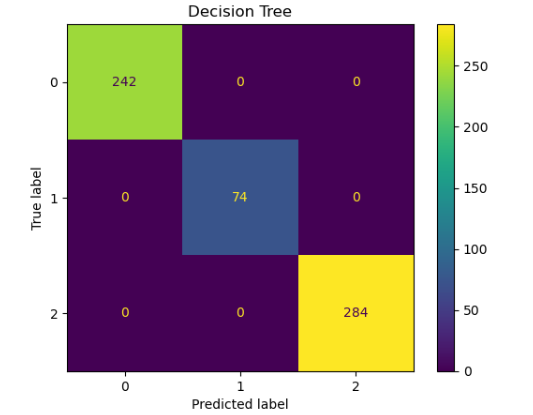
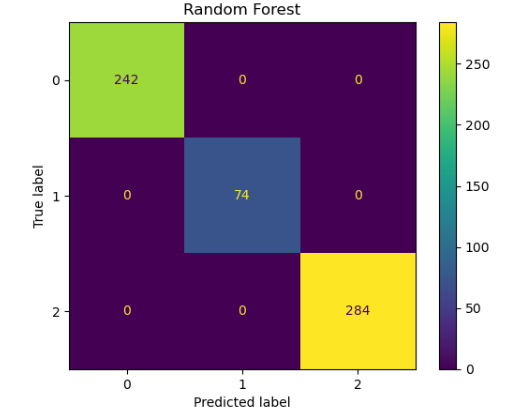
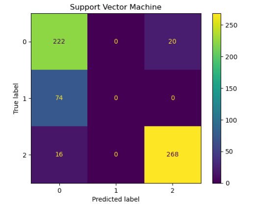

# Code-Quality-Predictor
A Machine Learning-based system that predicts source code quality using software metrics and a trained classification model.

## Project Overview

Source Code Quality Prediction is a Machine Learning based application that predicts the quality of source code using software metrics.

The system takes different code quality parameters as input and uses a trained ML model to classify and predict the quality level of the given source code.

The project provides a simple web interface where users can enter software metrics and get an instant prediction.

## Objective

The main objective of this project is to use Machine Learning techniques to analyze source code characteristics and predict code quality automatically.

It helps developers understand maintainability and quality issues in software projects.

## Features

- User-friendly web interface
- Machine Learning based prediction system
- Source code quality analysis using software metrics
- Real-time prediction through Flask application
- Input guide explaining each metric
- Trained ML model integration

## Technologies Used

### Programming Language
- Python

### Machine Learning
- Scikit-learn
- Pandas
- NumPy

### Web Development
- Flask
- HTML
- CSS

### Development Tools
- VS Code
- Anaconda Environment

## Software Metrics Used

The model uses the following metrics for prediction:

- Lines of Code (LOC)
- Code Complexity
- Number of Methods
- Number of Classes
- Coupling Between Objects (CBO)
- Lack of Cohesion (LCOM)
- Inheritance Depth (DIT)
- Response for Class (RFC)
- Number of Children (NOC)
- Weighted Methods Count (WMC)
- Comment Ratio
- Maintainability Index (MI)

## How It Works

1. Dataset is loaded and processed.
2. Machine Learning model is trained using source code quality metrics.
3. The trained model is saved as `model.pkl`.
4. Flask loads the trained model.
5. User enters code metrics through the web interface.
6. The model predicts the quality of the source code.

## Installation and Setup

### Clone the Repository

### Install Required Libraries
pip install -r requirements.txt

### Train the Model
python train_model.py

This will generate:
model.pkl

### Run the Application
python app.py

Open the local server:
http://127.0.0.1:5000

## Screenshots

### Home Page

### Prediction Result

### Quality Distribution

### Correlation Heatmap

### Model Comparison

### Confusion Matrix - Logistic Regression

### Confusion Matrix - Decision Tree Classifier

### Confusion Matrix - Random Forest Classifier

### Confusion Matrix - SVM

## Machine Learning Model

The trained model learns patterns from software metrics and predicts the quality category of source code based on the given input values.

The model is integrated with Flask to provide predictions through a web application.

## Future Improvements

- Add support for uploading source code files directly
- Improve prediction accuracy with larger datasets
- Add multiple ML algorithms comparison
- Provide detailed code improvement suggestions
- Add visualization dashboard for metrics

